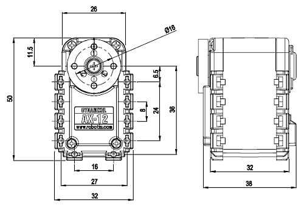
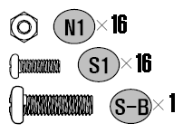
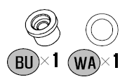

# AX-12A Smart Servo

Description | Specification
---|---
Weight | 54.6g
Dimension | 32mm x 50mm x 40mm
Gear Ratio | 254 : 1
Operation Voltage (V) | 12
Stall Torque (N.m) | 1.5 (12V)
Stall Current (A) | 1.5
No Load Speed (RPM) | 59 (12V)
Motor | Cored Motor
Minimum Control Angle | about 0.29 degrees x 1,024
Operating Range | Actuator Mode : 300 degrees Wheel Mode : Endless turn
Operating Voltage | 9-12V (Recommended voltage : 11.1V)
Max. Current | 900mA
Standby Current | 50mA
Operating Temperature | -5°C - 70°C
Command Signal | Digital Packet
Protocol | Half duplex Asynchronous Serial Communication (8bit,1stop,No Parity)
Link (physical) | TTL Level Multi Drop (daisy chain type Connector)
ID | 254 ID (0-253)
Baud Rate | 7843bps - 1 Mbps
Feedback Functions | Position, Temperature, Load, Input Voltage, etc.
Material | Case : Engineering Plastic Gear : Engineering Plastic
Position Sensor | Potentiometer
Default Setting | ID 1 (1 Mbps)

# Manual

[e-Manual](http://emanual.robotis.com/docs/en/dxl/ax/ax-12a/)

[AX-12A dimensions](AX-12A.pdf)

# Parts

---

	
	 This work is licensed under a <a rel="license" href="http://creativecommons.org/licenses/by-sa/4.0/">Creative Commons Attribution-ShareAlike 4.0 International License</a>.

