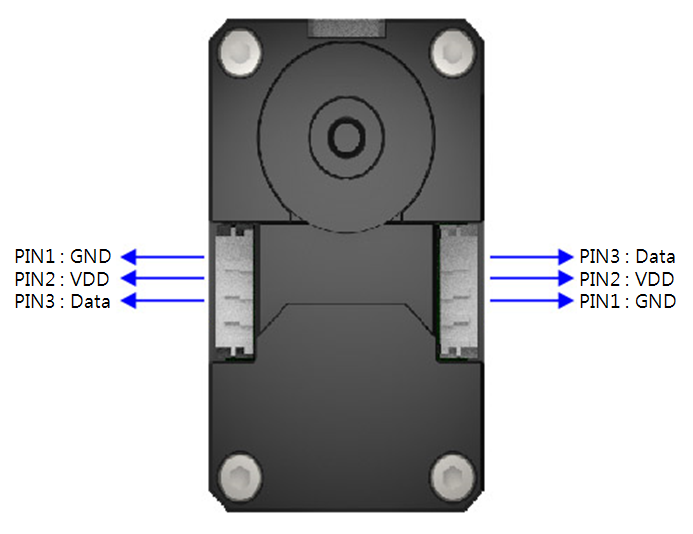

# XL430 Servo

I think Robotis feels this is the successor to the AX-12 line of smart servos,
but I honestly don't like the mounting options. Also, why did they change the
cable connectors ... WTF!

# Mounting

- Best place to mount is to use the corner M2.5 case screws located on the
servo corners
- Additional M2.6 (WTF?) holes are located around the case, but require
self-tapping screws to be useful
    - **Do not exceed** more than **4mm** into the casing or you could
    damage the servo

## New Version

There is a new version, as of Oct 2018, but I have no real idea what the difference
is.

# References

- [Dimensions](XL-430_new.pdf)
- Robotis: [XL430-w250-T](http://www.robotis.us/dynamixel-xl430-w250-t/)
