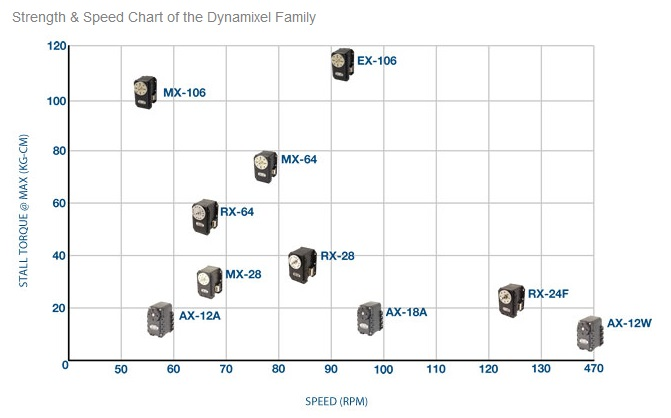

[](https://github.com/MultipedRobotics/pyservos/actions)


# pyServos

**Still under development**
**Starting to add XL-430 servo**

- pyservos
    - **ServoSerial** - half duplex hardware serial interface using DTR from a USB serial port
    - **PiServoSerial** - half duplex hardware serial interface using a HW pin
    - **utils** - misc
    - **XL320** - register/command/error definitions for Dynamixel's XL-320 servo
    - **AX12** - register/command/error definitions for Dynamixel's AX-12A servo
    - **XL430** - register/command/error definitions for Dynamixel's AX-12A servo

# Setup

## Install

The suggested way to install this is via the `pip` command as follows::

    pip install pyservos

## Development

I am currently using [poetry](https://python-poetry.org/) for my library and using
`pyproject.toml`. To submit git pulls, clone the repository and set it up as
follows:

    git clone https://github.com/MultipedRobotics/pyservos
    cd pyservos
    poetry install
    poety run pytest

# Usage

The `\bin` directory has a number of useful programs to set servo position or ID number. Just
run the command with the `--help` flag to see how to use it.

- `servoAX12`
- `servoXL320` (not implemented)
- `servoXL430` (not implemented)

The above commands have the following format:

 - servoXXX
    - **ping**: find servos on bus, ID[int|**None**]
    - **reboot**: reboot a servo, ID[int|**None**]
    - **reset**: reset a servo, ID[int], level[int]
    - **angle**: set new angle in degrees or radians, angle[float], radians[True|**False**]
    - **baudrate**: set new baudrate, rate[int]
    - **id**: set new ID, current_id[int], new_id[int]
- Values
    - ID: 1-254
    - reset level: 1 (all), 2(all but ID), 3 (all but ID and baudrate)
    - angle: 0-300 degrees
    - rate: 1000000 is default
    - None: if you leave out the value, there is a default that occurs which is safe

# Documentation

- [AX-12A Servo](https://github.com/MomsFriendlyRobotCompany/pyservos/tree/master/docs/ax12)
- [XL-320 Servo](https://github.com/MomsFriendlyRobotCompany/pyservos/tree/master/docs/xl320)
- [XL-430 Servo](https://github.com/MomsFriendlyRobotCompany/pyservos/tree/master/docs/xl430)

A simple example to turn the servo and turn the LED on using a USB serial converter:

```python
# Run an AX-12 servo
from pyservos.servo_serial import ServoSerial
from pyservos.ax12 import AX12

serial = ServoSerial('/dev/tty.usbserial')  # tell it what port you want to use
# serial = ServoSerial('dummy')  # use a dummy serial interface for testing
serial.open()

ax = AX12()
pkt = ax.makeServoPacket(1, 158.6)  # move servo 1 to 158.6 degrees
ret = serial.sendPkt(pkt)  # send packet, I don't do anything with the returned status packet

pkt = ax.makeLEDPacket(1, AX12.LED_ON)
ret = serial.sendPkt(pkt)
```

Although I have made some packet creators (like LED and Servo), you can make
your own using the basic `makeWritePacket` and `makeReadPacket`.

```python
# Run an XL-320 servo
from pyservos.xl320 import XL320
from pyservos.utils import angle2int

xl = XL320()

# let's make our own servo packet that sends servo 3 to 220.1 degrees
ID = 3
reg = XL320.GOAL_POSITION
params = angle2int(220.1)  # convert 220.1 degrees to an int between 0-1023
pkt = xl.makeWritePacket(ID, reg, params)
```

## Dynaixel Servos




## Robot Examples

Here are some example [robots](https://github.com/MultipedRobotics/pyservos/tree/master/docs/robots)

# Other Software

I haven't used these, but they seem good:

- c++: [libdynamixel](https://github.com/resibots/libdynamixel)

# Change Log

| | | |
|------------|-------|--------------------------------------------|
| 2020-01-25 | 2.0.0 | re-architected around protocols rather than servos types |
| 2018-04-30 | 1.0.1 |  API fixes and starting to add 430 support |
| 2018-02-17 | 1.0.0 |  added AX-12 support and renamed the library |
| 2017-04-01 | 0.9.0 |  added python3 support |
| 2017-03-26 | 0.8.0 |  major overhaul and removed the GPIO stuff |
| 2017-03-19 | 0.7.7 |  can switch between GPIO pin and pyserial.setRTS() |
| 2017-02-20 | 0.7.6 |  small fixes and added servo_reboot |
| 2017-01-16 | 0.7.5 |  fixes some small errors |
| 2016-11-29 | 0.7.4 |  add bulk write and small changes |
| 2016-10-11 | 0.7.1 |  small changes/updates |
| 2016-09-12 | 0.7.0 |  refactoring, still working on API |
| 2016-09-05 | 0.5.0 |  published to PyPi |
| 2016-08-16 | 0.0.1 |  init |

# The MIT License (MIT)

Copyright (c) 2016 Kevin J. Walchko

Permission is hereby granted, free of charge, to any person obtaining a copy of
this software and associated documentation files (the "Software"), to deal in
the Software without restriction, including without limitation the rights to
use, copy, modify, merge, publish, distribute, sublicense, and/or sell copies
of the Software, and to permit persons to whom the Software is furnished to do
so, subject to the following conditions:

The above copyright notice and this permission notice shall be included in all
copies or substantial portions of the Software.

THE SOFTWARE IS PROVIDED "AS IS", WITHOUT WARRANTY OF ANY KIND, EXPRESS OR
IMPLIED, INCLUDING BUT NOT LIMITED TO THE WARRANTIES OF MERCHANTABILITY, FITNESS
FOR A PARTICULAR PURPOSE AND NONINFRINGEMENT. IN NO EVENT SHALL THE AUTHORS OR
COPYRIGHT HOLDERS BE LIABLE FOR ANY CLAIM, DAMAGES OR OTHER LIABILITY, WHETHER
IN AN ACTION OF CONTRACT, TORT OR OTHERWISE, ARISING FROM, OUT OF OR IN
CONNECTION WITH THE SOFTWARE OR THE USE OR OTHER DEALINGS IN THE SOFTWARE.
