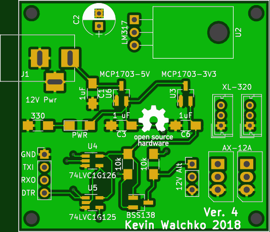

# Serial Port

## Robotis Suggestion

There are many ways (chip combinations) to achieve this interface.

## My Board

The serial interface talks to both AX-12 (12V power) and XL-320 (8V power)
servos. The design uses SMD parts, but they are all hand solderable.

- RPi TX is attached to a 74LV126 single gate, OE operates when **HIGH**
- RPi RX is attached to a 74LV125 single gate, OE operates when **LOW**
- RPi DTR (any pin really) is connected to the OE on both chips
- Gates are both 5V tolerant on input and have a VCC range of 1.65 - 5.5V
- Both gates are setup for 3.3V operations, with a MOSFET setup to level shift
the DATA line
- The behavior follows the above Robotis suggestion for half duplex operation

[schematic](serial.pdf)

